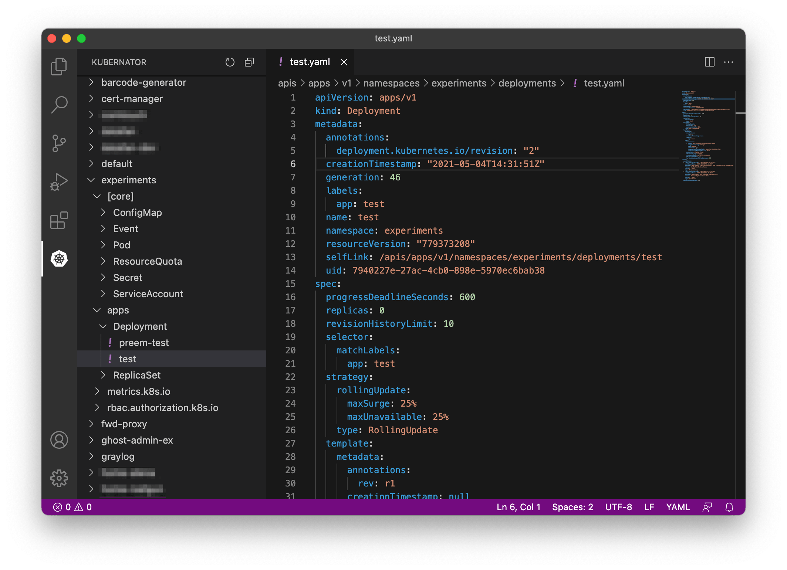

# Kubernator

Kubernetes object tree viewer and manifest editor. Lightweight and fast, compared to similar extensions on the marketplace.

## Features

* view your cluster objects grouped by namespace, including Custom Resources
* edit, create, delete object manifests and apply them to your cluster
* clean object manifest, stripping read-only fields and fields with default values
* RBAC friendly
* multilpe clusters, but only one active per vscode instance for solidity
* uses `kubectl proxy` to be fast and friendly

## Requirements

`kubectl` should be in the PATH and authorized.

## Example usage

### Edit object

1. Select some object in tree view, e.g. any Deployment. A manifest editor will open.
2. Make changes to the manifest.
3. Save the manifest as always. The changes will apply to your cluster.

### Clone and edit object

1. Select some object in tree view, e.g. any Deployment. A manifest editor will open.
2. Run command `Kubernator: Clean` in command palette. A new tab with cleaned manifest will open.
3. Make changes to the manifest.
4. Run command `Kubernator: Create` in command palette. New object will be created in your cluster and a new tab with this object will open.

## Commands

Important commands:

* `Kubernator: Create`: analogue of `kubectl create -f manifest.yaml` for active editor
* `Kubernator: Clean`: clean manifest in active editor, deleting read-only fields and fields with defaults
* `Kubernator: Delete`: delete object in active editor
* `Kubernator: Reveal`: reveal object in active editor
* `Kubernator: Reconfigure`: reload API resources and manifest schema (executed on startup, maybe required after CRD installation or cluster upgrade)

## Context menu actions

* `Pod` → `Shell`: create terminal with command `kubectl -n NS exec -it POD_NAME -- sh`
* `PVC` → `Go to PV`: reveal PV bound to the PVC

## Settings

See **Feature Contributions** extension page.
